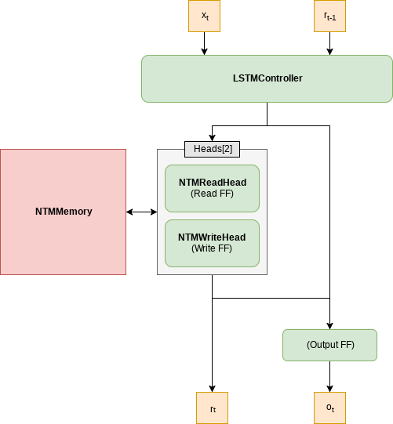
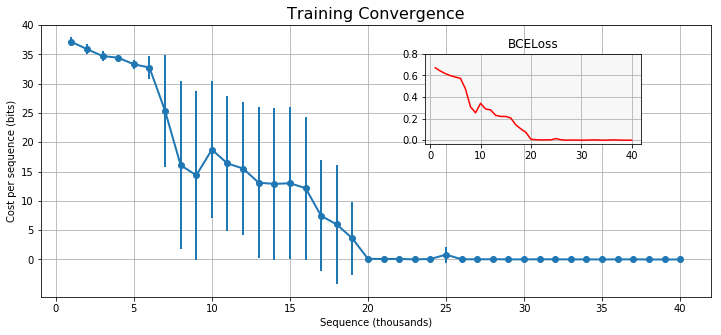
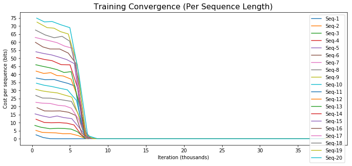
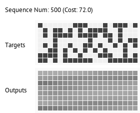
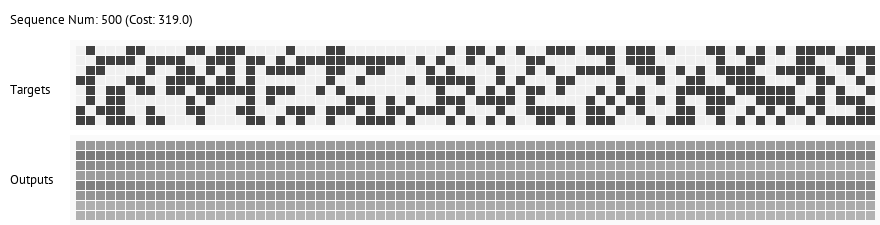

# PyTorch Neural Turing Machine (NTM)

PyTorch implementation of [Neural Turing Machines](https://arxiv.org/abs/1410.5401) (NTM).

An **NTM** is a memory augumented neural network (attached to external memory) where the interactions with the external memory (address, read, write) are done using differentiable transformations. Overall, the network is end-to-end differentiable and thus trainable by a gradient based optimizer.

The NTM is processing input in sequences, much like an LSTM, but with additional benfits: (1) The external memory allows the network to learn algorithmic tasks easier (2) Having a larger capacity without increasing the network's trainable parameters.

The external memory allows the NTM to learn algorithmic tasks, that are much harder for LSTM to learn, and to maintain an internal state much longer than traditional LSTMs.

## A PyTorch Implementation

This repository implements a vanilla NTM in a straight forward way. The following architecture is used:

* Support for batch leanring
* Any read or write head configuration is supported (for example, 5 read heads and 2 write heads), the order of operation is specified by the user

Example of training convergence for the **copy task** using 4 different seeds.

 The following plot shows the cost per sequence length during training, the network was trained with `seed=7` and shows a fast convergence. Other seeds may not perform as well but should converge in less than 30K iterations.

Here is an animated GIF that shows how the model generalize. The model was evaluated after every 500 training samples, using the target sequence shown in the upper part of the image. The bottom part shows the network output at any given training stage.

The following is the same, but with `sequence length = 80`. Note that the network was trained with sequences of lengths 1 to 20.

## Installation

The NTM can be used as a reusable module, currently not packaged though.

1. Clone repository
2. Install [PyTorch](http://pytorch.org/)
3. pip install -r requirements.txt

## Usage

> python train.py

